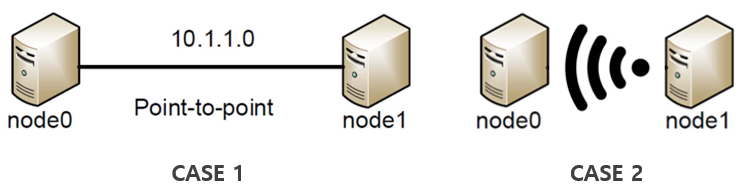

# (TITLE) VideoStream - Team 8

## Introduction

## Installation

### Prerequisites
ns-3 (version 3.30), Python (`python 2.7+` or `python 3.5+`), C++ compiler (`clang++` or `g++`), Gnuplot

### How to install

1. Download and build `ns-3` following the official document [here](https://www.nsnam.org/docs/release/3.30/tutorial/singlehtml/index.html#getting-started).
2. Copy the files **exactly** into the folders of the `ns-3`. (Be aware of the `wscript` in `src->applications`, otherwise the video streaming application will not be installed!)
3. Run `./waf` or `./waf build` to build the new application.
4. Run `./waf --run videoStreamer 2> stream.dat` for the testing program and make output data file(you can change `CASE` in `videoStreamTest.cc` for different network environments).

### How to make graph
1. Type the following commands 

`awk '$1=="0" {print $2 "\t" $3}' stream.dat > buffer.dat`
`awk '$1=="1" {print $2 "\t" $3}' stream.dat > playtime.dat`
`awk '$1=="2" {print $2 "\t" $3}' stream.dat > videolevel.dat`
`gnuplot`
`set term png`
`set output "stream.png"`
`set y2tics`
`set tics nomirror`
`set y2range [0:5]`
`plot "buffer.dat" using 1:2 title "BufferCount" with linespoints, "playtime.dat" using 1:2 title "PlayTime" with linespoints, "videolevel.dat" using 1:2 axes x1y2 title "ResolutionLevel" with linespoints`

2. Quit gnuplot and check `stream.png` file.

## Results

### Network configurations

- (1) P2P network with 1 server and 1 client
- (2) Wireless network with 1 server and 1 client

 
### Simulation

#### 실험 세팅

##### 1. Application

동영상 길이는 총 300 frame  
1초당 5 frame 영상을 송출한다고 가정  
사용자가 특정 배속으로 동영상을 요청하면 1초당 frame 수가 배속에 비례하여 증가  

1 frame당 해상도(resolution) level  

Resolution Level 0 : 100001 bytes for 1 frame  
Resolution Level 1 = 150001 bytes for 1 frame  
Resolution Level 2 = 200001 bytes for 1 frame  
Resolution Level 3 = 230001 bytes for 1 frame  
Resolution Level 4 = 250001 bytes for 1 frame  
Resolution Level 5 = 300001 bytes for 1 frame  

초기에 resolution level 5 로 동영상을 전송  
버퍼링이 1초 이상 지속되면 resolution level을 조절해 버퍼링을 1초 이하로 줄임.  
버퍼에 충분한 frame이 존재하면 다시 resolution level을 증가.  

##### 2. Topology

1. 1:1 P2P Link
2. 1:1 WiFi Link

