# (TITLE) VideoStream - Team 8

## Introduction

This project was conducted for the network project team project for the first semester of 2022 at Sungkyunkwan University.
Based on the ns-3 and network models learned in class, a "speed controlled streaming service" was implemented.
Team member is Kang Seung Mok, Yoon So Hee, Lee In Su, Lee Hyun Jeong, Cha Jeong Min and Choi Jae Ik.
We divided it into a development team and a simulation team.

- Team Development : Kang Seung Mok, Yoon So Hee, Lee Hyun Jeong, Choi Jae Ik
- Team Simulation : Lee In Su, Cha Jeong Min

## Installation

### Prerequisites
ns-3 (version 3.30), Python (`python 2.7+` or `python 3.5+`), C++ compiler (`clang++` or `g++`), Gnuplot

### How to install

1. Download and build `ns-3` following the official document [here](https://www.nsnam.org/docs/release/3.30/tutorial/singlehtml/index.html#getting-started).
2. Copy the files **exactly** into the folders of the `ns-3`. (Be aware of the `wscript` in `src->applications`, otherwise the video streaming application will not be installed!)
3. Run `./waf` or `./waf build` to build the new application.
4. Run `./waf --run videoStreamer 2> stream.dat` for the testing program and make output data file(you can change `CASE` in `videoStreamTest.cc` for different network environments).

### How to change the case
During speed control, buffering occurs when the speed increases too much, so it is implemented to automatically improve resolution.
The following two variable values can be adjusted to execute them at the desired speed and resolution. The supported resolution is classified into six levels.

- m_videoSpeed : Variable that determines the speed level
- m_videoLevel : Variable that determines the resolution level

### How to make graph
1. Type the following commands 

`awk '$1=="0" {print $2 "\t" $3}' stream.dat > buffer.dat`

`awk '$1=="1" {print $2 "\t" $3}' stream.dat > playtime.dat`

`awk '$1=="2" {print $2 "\t" $3}' stream.dat > videolevel.dat`

`gnuplot`

`set term png`

`set output "stream.png"`

`set y2tics`

`set tics nomirror`

`set y2range [0:5]`

`plot "buffer.dat" using 1:2 title "BufferCount" with linespoints, "playtime.dat" using 1:2 title "PlayTime" with linespoints, "videolevel.dat" using 1:2 axes x1y2 title "ResolutionLevel" with linespoints`

2. Quit gnuplot and check `stream.png` file.

### Detailed explanation
This video streaming program start with high video resolution. It automatically modify the video quality according to the current buffering. If you want to get more detailed information, check the `Results` section right down below.

## Issue

During speed control, buffering occurs when the speed increases too much, so it is implemented to automatically improve resolution.

## Results

### Network configurations

- (1) P2P network with 1 server and 1 client
- (2) Wireless network with 1 server and 1 client

 
### Case of requesting video with speed x1

Set a `m_videoSpeed` in `video-stream-client.cc`, and you are expected to get the graph like this.

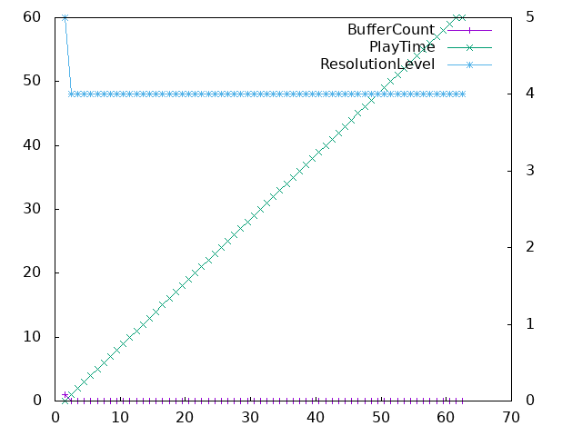
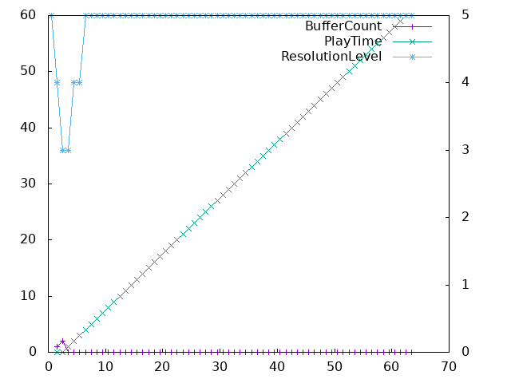
- (1) P2P Link
- (2) WiFi Link

The left axis of the graph is video playtime. Since the video is 300 frames and the program takes 5 frames per second, we can see the total playtime is around 60 seconds.

The right axis of the graph is resolution level. There are 6 resolution levels(0 to 5) and always start from level 5.

The buffer count is a buffering counter to reproduce the image, but it may be seen that it does not exceed 1 second or more.

### Case of requesting video with speed x1.2

Set a `m_videoSpeed` in `video-stream-client.cc`, and you are expected to get the graph like this.

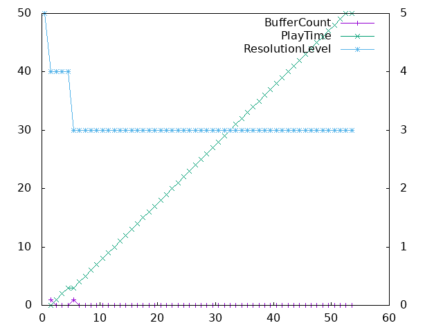
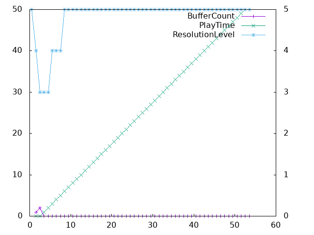
- (1) P2P Link
- (2) WiFi Link

### Case of requesting video with speed x1.4

Set a `m_videoSpeed` in `video-stream-client.cc`, and you are expected to get the graph like this.

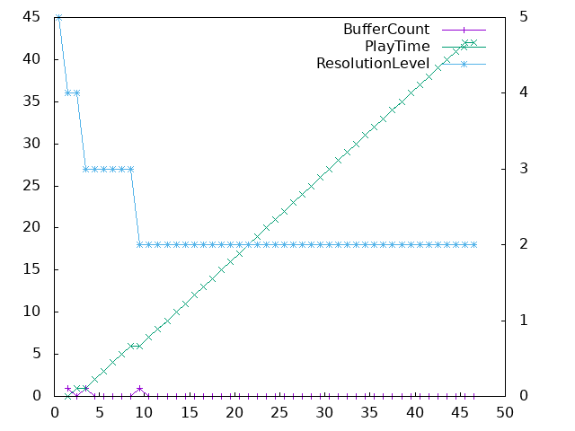
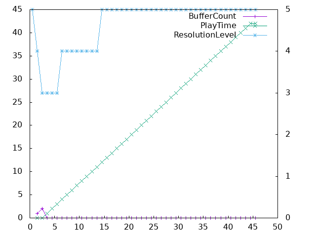
- (1) P2P Link
- (2) WiFi Link

### Case of requesting video with speed x1.6

Set a `m_videoSpeed` in `video-stream-client.cc`, and you are expected to get the graph like this.

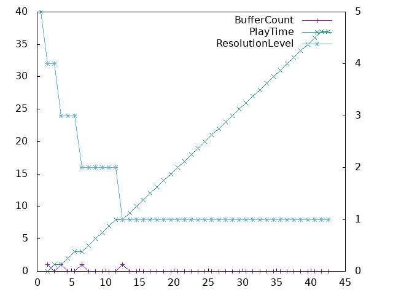
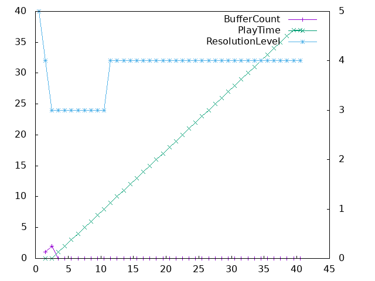
- (1) P2P Link
- (2) WiFi Link

### Case of requesting video with speed x1.8

Set a `m_videoSpeed` in `video-stream-client.cc`, and you are expected to get the graph like this.

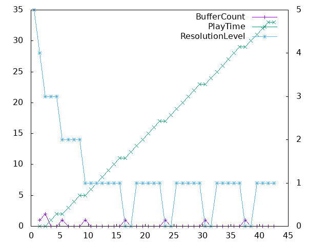
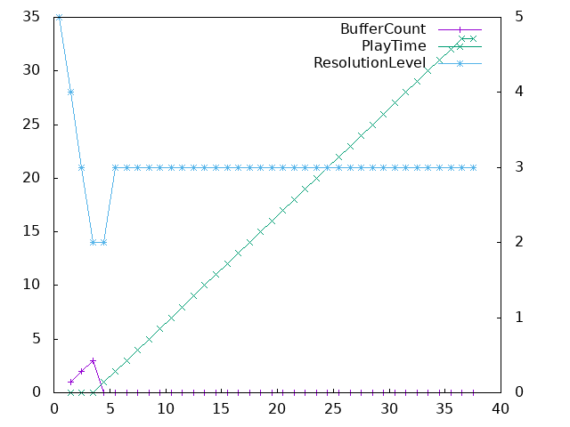
- (1) P2P Link
- (2) WiFi Link

### Case of requesting video with speed x2

Set a `m_videoSpeed` in `video-stream-client.cc`, and you are expected to get the graph like this.

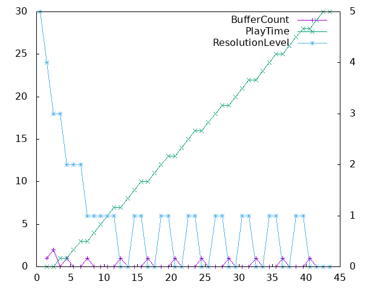
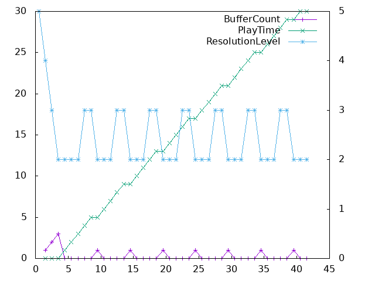
- (1) P2P Link
- (2) WiFi Link
